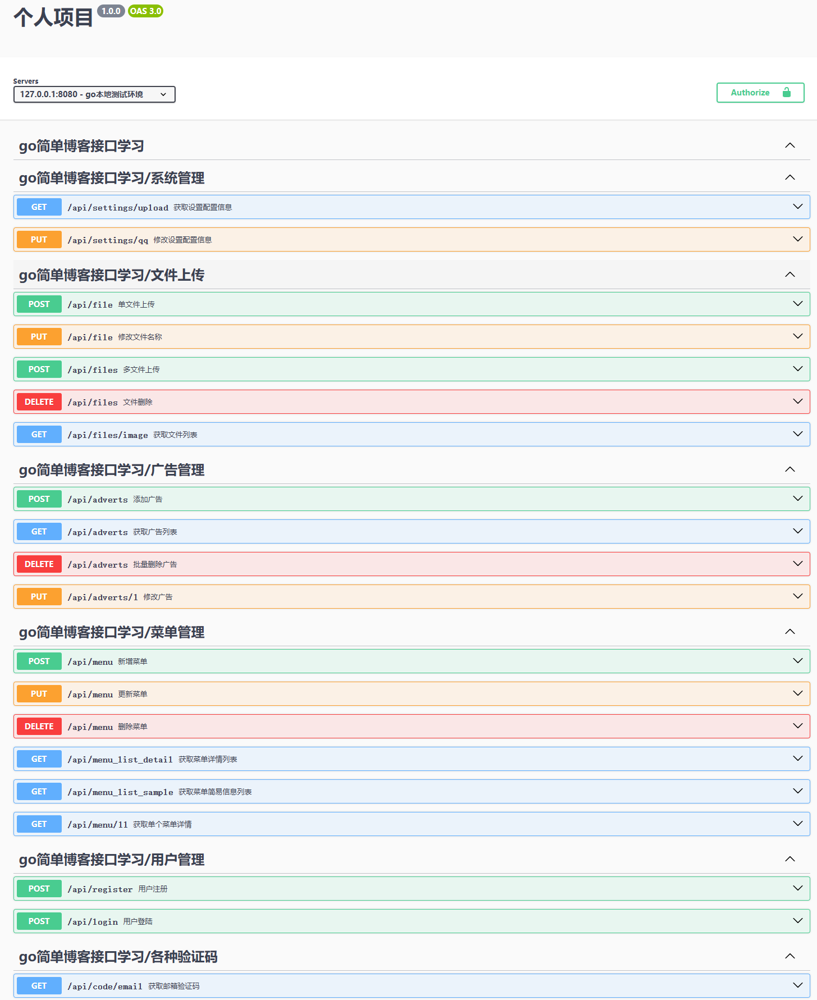

# 本项目仅供学习参考，请勿用于商业用途。
### 项目介绍
本项目是按照[B站 枫枫知道 【博客项目】gin-vue-blog后端教程 | 前后端分离 | 已完结](https://www.bilibili.com/video/BV1f24y1G72C/?spm_id_from=333.999.0.0&vd_source=875616cb9d45eb280c446795aca86cf9)制作完成

本人是看完每一集之后再通过自己的一些理解自己改写的，可能和视频上有所出入，但是基本差不多一个样子，现在只做到了55集那样子，后续有空会继续完善，此项目给需要的小伙伴参考学习

目前项目大改有20个接口，其中注册登录接口只写了部分，还未完善，如图

## 快速开始

**启动项目方式：**
1. 需要下载安装依赖的包，命令：`go mod download`
2. 可以采用air命令启动项目，命令：`air`，或者命令：`go run main.go`

## 数据库迁移
1. 执行命令：`go run main.go -db` 确保数据库已经创建好
2. 或者直接将 static 目录下的[blog.sql](static/blog.sql)文件导入到数据库中也行

## 关于[settings.yaml](settings.yaml)文件
这里最主要的是为email添加授权码和密码（两个是一样的）
不懂添加的小伙伴可以直接百度邮箱stmp授权码

# 如果大家觉得帮助到了自己，可以点个star支持一下哦，谢谢！后续有空我回继续完善。
